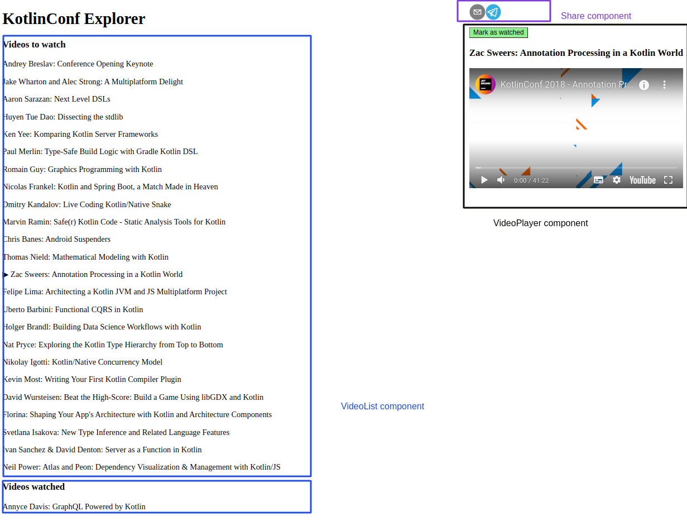

# Construindo uma aplicação com React e KotlinJS Hands-On Lab

## O que foi aprendido

- Como utilizar Kotlin com React
- Html com tipagem estática
- Utilizar pacotes NPM com gradle
- Componentização
- Coroutines básico
- Conceitos avançados da linguagem Kotlin
- Gerenciamento e compartilhamento de estado da aplicação e do componente

## Minhas impressões acerca do tutorial

Apesar do poder da linguagem Kotlin, não achei muito intuitivo escrever um SPA com Kotlin. 
De qualquer forma você precisa saber sobre JS e React para entender o que está acontecendo por traz dos panos. 
Então, eu preferiria aprender diretamente o react do que aprender a usar o KotlinJS juntamente com React. 

## Resumo

A imagem abaixo ilusta a aplicação desenvolvida separada por componentes.

- O componente `VideList` lista videos de uma API e quando é clicado em algum video na lista ele altera o `videoPlayer` component.
  Além disso, vc tem o mesmo componente abaixo que são os vídeos já assistidos
- O component `videoPlayer` mudar conforme o click no vídeo da lista. Ele altera conforme a URL que o vídeo possui.
- O Component `Share` é para compartilhar via email ou telegram o vídeo

Todos os componentes compartilham um estado do video selecionado para ser reproduzido e compartilhado.